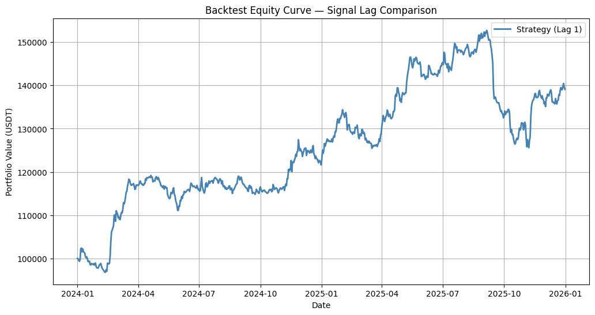
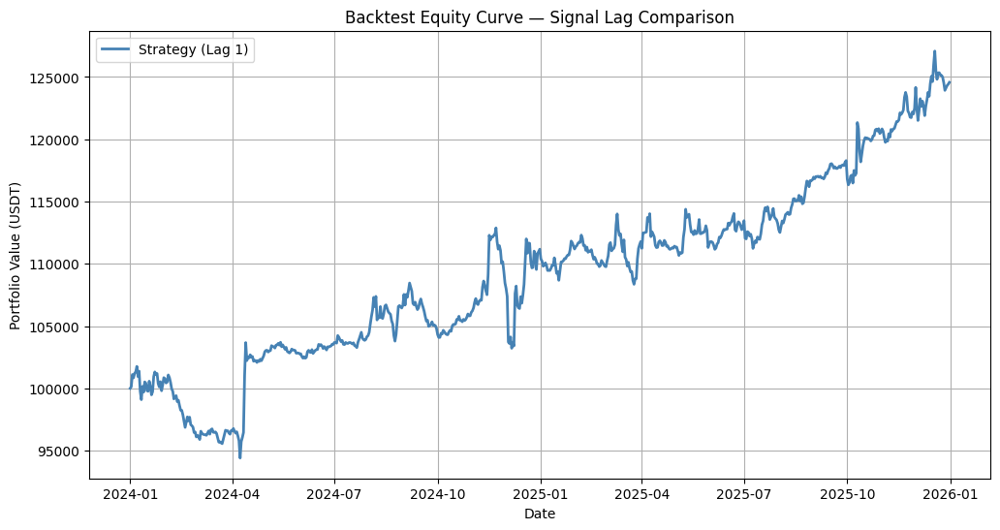
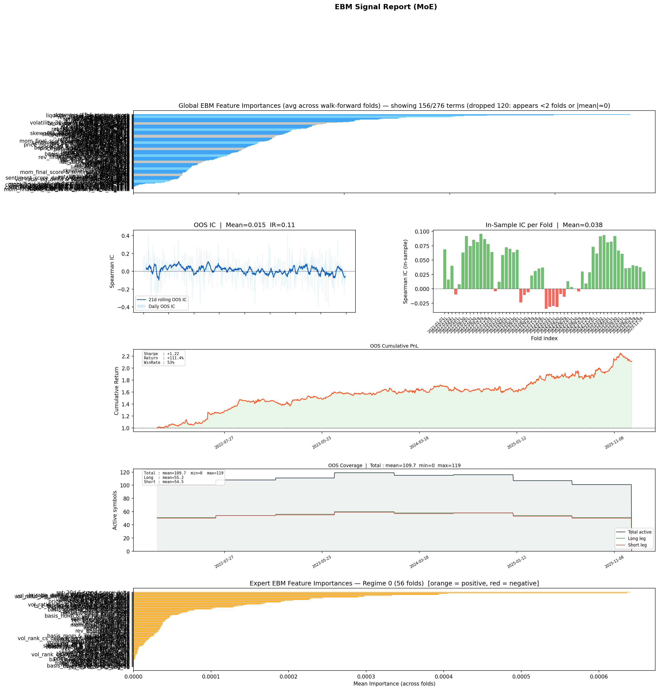
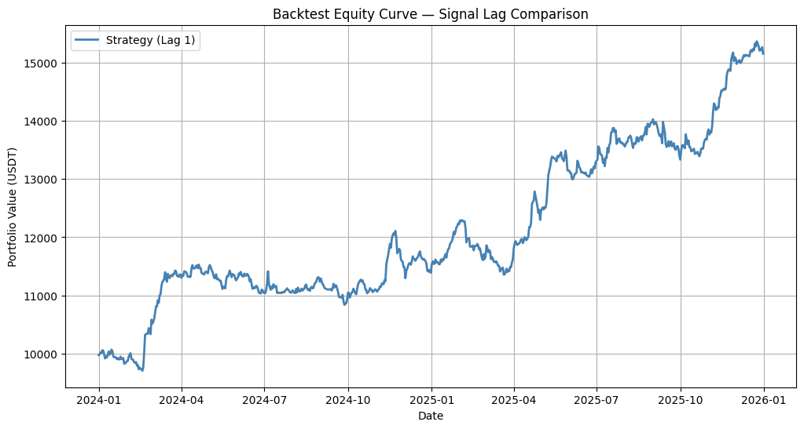
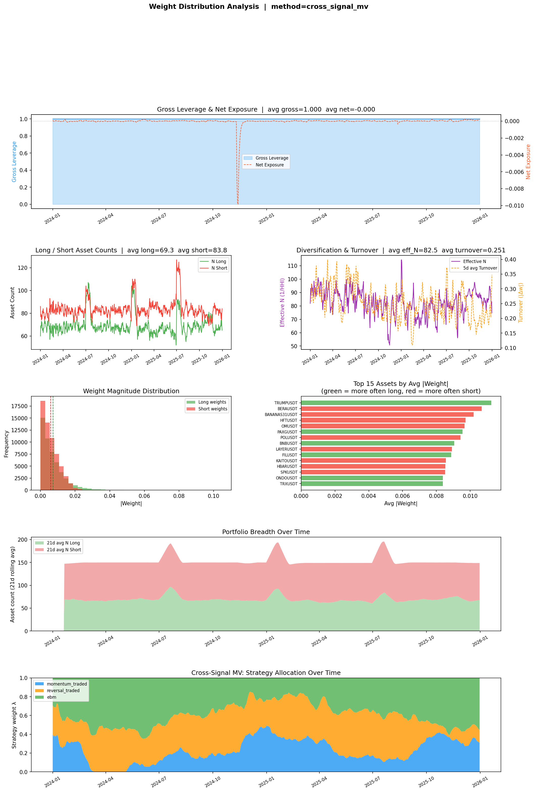

# Binance Crypto Alpha Research

## 1. Introduction

- **Systematic mid-frequency statistical-arbitrage** on the Binance
  perpetual-futures market.
- Trades a broad cross-section of liquid USDT-margined perpetual
  contracts on a **daily rebalancing cycle**.
- Long and short positions sized to be **market-neutral** and
  dollar-balanced at portfolio level.
- Each contract enters the tradable universe only after passing a
  **quarterly liquidity and continuity filter**; the universe rolls
  forward through the backtest so that delisted or freshly-listed
  contracts are added and removed at the right point in time,
  preventing survivorship bias.

|                     |                                                                                                                        |
| ------------------- | ---------------------------------------------------------------------------------------------------------------------- |
| **Market**          | Binance USDT-margined perpetual futures                                                                                |
| **Frequency**       | Mid-frequency, daily rebalance                                                                                         |
| **Style**           | Cross-sectional statistical arbitrage, market-neutral                                                                  |
| **Universe**        | 150 symbols, rolling quarterly refresh                                                                                 |
| **Backtest window** | 20210101 — 20260101                                                                                                    |
| **Cost model**      | 5 bps fee + 2 bps slippage                                                                                             |
| **Data sources**    | Binance Futures REST (price, volume), funding-rate history, open-interest archive, top-trader long/short ratio archive |

---

## 2. Signal Pipeline

Three independent signals feed a portfolio combiner. All three share two
construction invariants that are applied at every stage of the pipeline:

- **Cross-sectional neutralisation.** Every raw signal is residualised
  against a rolling market beta before any portfolio construction. The
  model therefore trades idiosyncratic dispersion rather than leveraged
  market exposure.
- **Persistent long/short balance.** The weight construction enforces
  approximately equal gross capital on the long and short sides each day,
  so the strategy retains its market-neutral profile across regime shifts
  rather than drifting net long in bull markets or net short in
  drawdowns.

### 2.1 Momentum

- Cross-sectional preference for assets whose price trend is supported
  by an **expansion in open interest** — positions accumulating in the
  direction of the move.
- **Funding-rate filter** down-weights signals when the funding side
  disagrees with the price direction (a crowded-trade flag).
- **Volatility-rank adjustment** shrinks positions in unusually noisy
  names.

### 2.2 Liquidation Reversal

- Targets dislocations caused by **liquidation cascades**: an unusually
  large one-day drop in open interest is a forced-position flush that
  tends to mean-revert within a few days.
- **Liquidation shock** component flags the abnormal OI move.
- **Regime score** encompasses long/short ratio change to indicate
  shifts in market regime.
- Event-driven and naturally **counter-cyclical to the momentum strategy**.

### 2.3 EBM Machine-Learning Signal

- **Explainable Boosting Machine** trained walk-forward on the full
  factor panel.
- Non-parametric in its feature relationships — discovers piecewise
  shape functions and pairwise interactions rather than imposing them.
- Global model is trained with factors **neutralised with respect to
  the regime separator**, which is market volatility in our experiment.
- A **mixture-of-experts** extension trains a per-regime expert on the
  global model's residuals so that the residual structure inside each
  regime can be captured.
- The model is trained only with factors **passing shape-health
  analysis**.

### 2.4 Portfolio Combiner

- Daily **mean-variance optimisation** in strategy-return space.
- **EMA smoothing** as a post-process on the final signal.

---

## 3. Performance

All strategies use the same train / test split:

- **In-sample (IS):** 2021-01-01 → 2024-12-31 — used for parameter
  selection, walk-forward training (for EBM), and stability inspection.
- **Out-of-sample (OOS):** 2025-01-01 → 2025-12-31 — held out and
  evaluated only after the IS configuration is frozen.

Strategy parameters were selected by **sparse grid search** over the IS
window, retaining only configurations that sit inside a **manually-verified
stable region** of the parameter landscape (i.e. surrounded by neighbouring
grid points with consistent IS performance). This deliberately avoids
fitting to isolated peaks, biasing the selection toward parameter choices
whose IS edge is robust to small perturbations.

### 3.1 Liquidation Reversal

- **IS:** 2021-01-01 → 2024-12-31 — used to choose `ts_lookback`,
  `sentiment_ma_window`, `half_life_decay`, and the risk-control knobs
  (`max_weight`, `min_active_symbols`).
- **OOS:** 2025-01-01 → 2025-12-31.

|                   |         |
| ----------------- | ------- |
| Final return      | 30.95 % |
| Annualised Sharpe | 0.65    |
| PSR (SR\* = 0)    | 0.9923  |

### 3.2 Momentum

- **IS:** 2021-01-01 → 2024-12-31 — used to tune `lookback`,
  `smooth_lookback`, `funding_z_threshold`, and the vol-rank adjustment.
- **OOS:** 2025-01-01 → 2025-12-31.

|                   |         |
| ----------------- | ------- |
| Final return      | 65.69 % |
| Annualised Sharpe | 1.25    |
| PSR (SR\* = 0)    | 0.982   |

### 3.3 EBM ML Signal

- **IS (walk-forward training):** 2021-01-01 → 2024-12-31 — every fold
  re-trains on a trailing 252-day window inside the IS range and predicts
  the next `retrain_freq` days. Used to fix `train_window`,
  `retrain_freq`, `interactions`, `min_samples_leaf`, and the MoE
  routing settings.
- **OOS:** 2025-01-01 → 2025-12-31 — the model continues its
  walk-forward retrain cycle over this held-out year; reported metrics
  are computed only on these predictions.

- **Top:** per-fold feature importance.
- **Bottom-left:** in-sample vs out-of-sample information coefficient
  over time.
- **Bottom-right:** cumulative PnL of the EBM signal in isolation.

|                   |        |
| ----------------- | ------ |
| Final return      | 111.4% |
| Annualised Sharpe | 1.22   |
| PSR (SR\* = 0)    | 99.98  |

### 3.4 Combined Portfolio

- Blends the three signals through the strategy-space mean-variance
  optimiser.
- **IS:** 2021-01-01 → 2024-12-31 — used to fit the strategy-space
  covariance shrinkage and EMA smoothing of the combined weight vector.
- **OOS:** 2025-01-01 → 2025-12-31 — reported metrics are computed on
  the held-out year only.

- The lower panel reports **gross leverage and net exposure**,
  **long-short asset counts**, the **effective number of positions**,
  **daily turnover**, the **weight-magnitude histogram**, and the
  **most-traded symbols**.
- Net exposure tracks zero and long-short asset counts move in
  lock-step — the persistent market-neutral and dollar-balanced
  behaviour described above.

|                   |          |
| ----------------- | -------- |
| Total return      | 97.7 %   |
| Annualised Sharpe | 1.**53** |
| PSR (SR\* = 0)    | .9974    |
